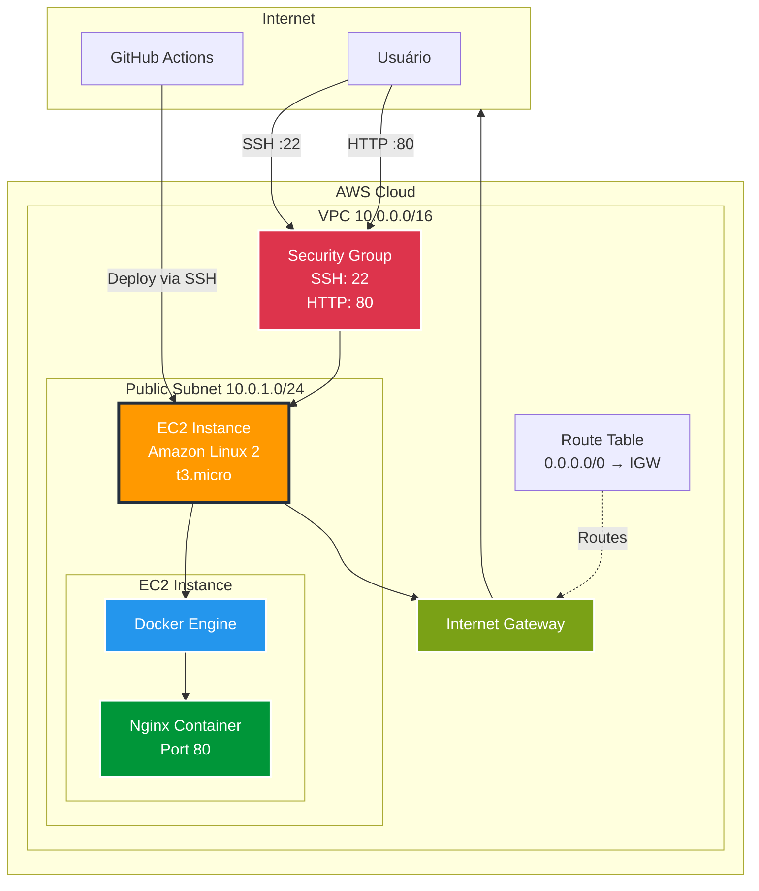
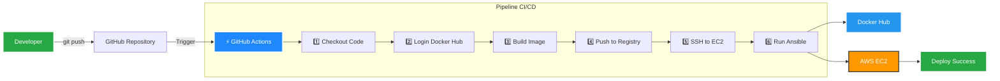
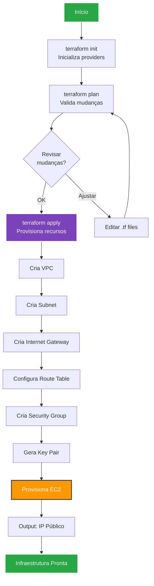
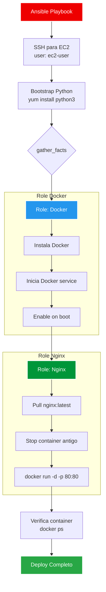
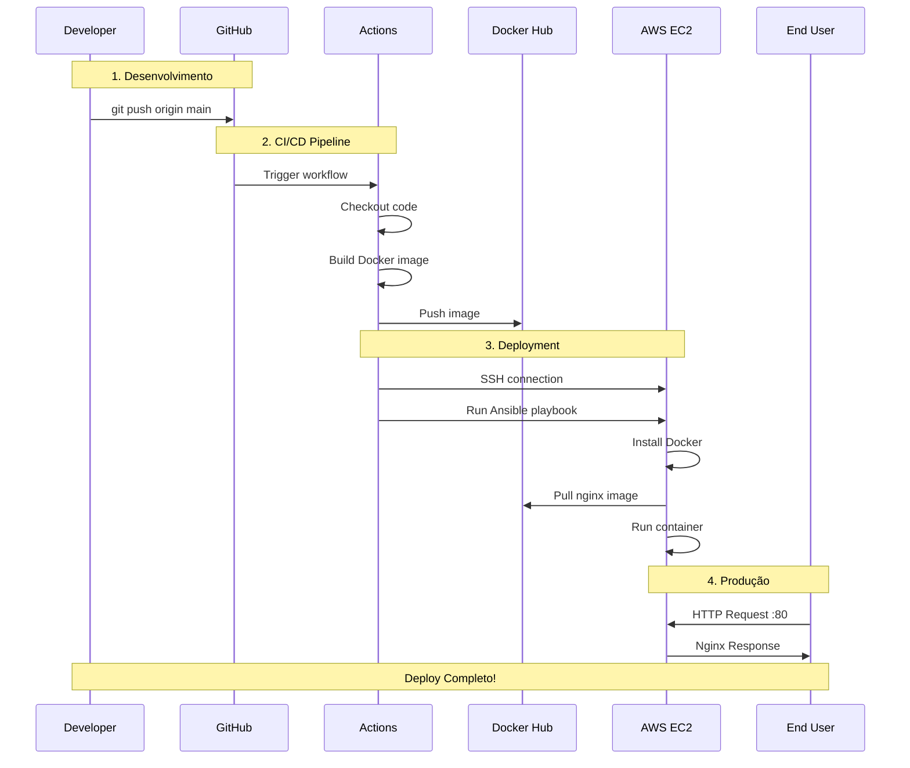

# Projeto DevOps – AWS com Terraform, Ansible, Docker, Nginx e CI/CD

Este projeto demonstra a construção de uma infraestrutura completa na AWS, utilizando **Infraestrutura como Código (IaC)**, automação de configuração, containers e **CI/CD**, seguindo práticas reais de ambientes DevOps e Cloud.

A solução provisiona automaticamente:

-  Infraestrutura de rede na AWS (VPC, Subnet, Security Group)
-  Instância EC2
-  Instalação e configuração de Docker via Ansible
-  Deploy de uma aplicação Nginx em container Docker
-  Pipeline CI/CD com GitHub Actions, build de imagem e deploy automatizado

##  Índice Visual

- [ Arquitetura AWS](#️-arquitetura-do-projeto)
- [ Pipeline CI/CD](#-pipeline-cicd-github-actions)
- [ Fluxo End-to-End](#-fluxo-completo-end-to-end)
- [ Fluxo Terraform](#️-provisionar-infraestrutura-com-terraform)
- [ Fluxo Ansible](#-nginx-container)
---

##  Tecnologias Utilizadas

### Infraestrutura e Automação
- **Terraform** – Provisionamento de infraestrutura (IaC)
- **Ansible** – Automação de configuração e deployment
- **GitHub Actions** – Pipeline CI/CD
- **AWS CLI** – Autenticação e integração local

### AWS Services
- **VPC** – Rede virtual privada
- **Subnet** – Sub-rede pública
- **Internet Gateway** – Conectividade externa
- **Route Table** – Tabela de rotas
- **Security Group** – Firewall virtual
- **EC2** – Instância de computação
- **Key Pair** – Autenticação SSH

### Containers e Aplicação
- **Docker** – Execução de containers
- **Docker Hub** – Registry de imagens
- **Nginx** – Aplicação web de demonstração

### Sistema Operacional
- **Amazon Linux 2** (EC2)
- **Ubuntu** (GitHub Actions runner)
- **Pop!_OS / Linux** (máquina local)

### Outros
- **SSH** – Acesso remoto seguro
- **Git & GitHub** – Versionamento e CI/CD

---

##  Arquitetura do Projeto



##  Pipeline CI/CD (GitHub Actions)

###  Fluxo Visual do Pipeline



### O que o pipeline faz:

1.  **Checkout** do código do repositório
2.  **Login** no Docker Hub (via Secrets)
3.  **Build** da imagem Docker
4.  **Push** da imagem para o Docker Hub
5.  **Conexão SSH** na instância EC2
6.  **Deploy automatizado** via Ansible

###  Secrets Configurados

| Secret              | Descrição                     |
|---------------------|-------------------------------|
| `DOCKERHUB_USERNAME`| Usuário do Docker Hub         |
| `DOCKERHUB_TOKEN`   | Token de acesso do Docker Hub |
| `EC2_SSH_KEY`       | Chave privada SSH da EC2      |

> ** Segurança:** Nenhuma credencial sensível está versionada no repositório. Todas as secrets são gerenciadas pelo GitHub Secrets.

###  Trigger do Pipeline

O pipeline é executado automaticamente a cada **push** na branch `main`:

```bash
git add .
git commit -m "Update application"
git push origin main
```

O GitHub Actions irá:
- Buildar a nova imagem
- Fazer push para o Docker Hub
- Conectar na EC2 via SSH
- Executar o deployment com Ansible

---

##  Estrutura de Pastas

```
.
├── terraform/
    ├── provider.tf        # Configuração do provider AWS
    ├── network.tf         # VPC, Subnet, IGW e Route Table
    ├── security.tf        # Security Groups
    ├── compute.tf         # EC2 e Key Pair
    ├── outputs.tf         # IP público da EC2
├── ansible/
│   ├── inventory.ini  # Inventário com IP da EC2
│   ├── playbook.yml   # Playbook principal
│   └── roles/
│       ├── docker/    # Role para instalação do Docker
├── app/
│   └── Dockerfile     # Imagem Docker customizada
├── .github/
│   └── workflows/
│       └── ci-cd.yml  # Pipeline de CI/CD
└── README.md
```

##  Como Usar

### Pré-requisitos

-  AWS Account ativa
-  AWS CLI configurado
-  Terraform instalado (>= 1.0)
-  Ansible instalado (>= 2.9)
-  Git instalado
-  Conta no Docker Hub
-  Repositório GitHub configurado

### 1️⃣ Configurar AWS CLI

Configure suas credenciais AWS localmente:

```bash
aws configure
```

### 2️⃣ Provisionar Infraestrutura com Terraform

####  Fluxo de Provisionamento



#### Comandos:

```bash
# Inicializar o Terraform
terraform init

# Formatar código (opcional)
terraform fmt

# Planejar as mudanças
terraform plan

# Aplicar a infraestrutura
terraform apply
```

### 3️⃣ Configurar Secrets no GitHub

No seu repositório GitHub, vá em **Settings → Secrets and variables → Actions** e adicione:

- `DOCKERHUB_USERNAME` – Seu usuário do Docker Hub
- `DOCKERHUB_TOKEN` – Token de acesso do Docker Hub
- `EC2_SSH_KEY` – Conteúdo da chave privada SSH (terraform-key.pem)

### 4️⃣ Deploy via CI/CD

Faça qualquer alteração e envie para o GitHub:

```bash
git add .
git commit -m "Deploy application"
git push origin main
```

O **GitHub Actions** executará automaticamente:
- Build da imagem Docker
- Push para Docker Hub
- Deploy na EC2 via Ansible

### 5️⃣ Acessar a Aplicação

```bash
# Obter o IP público (output do Terraform)
terraform output ec2_public_ip

# Acessar via SSH
ssh -i terraform-key.pem ec2-user@<IP_PUBLICO>

# Acessar via navegador
http://<IP_PUBLICO>
```

### 6️⃣ Destruir Recursos

Quando finalizar, destrua todos os recursos para evitar custos:

```bash
terraform destroy
```

##  Componentes Detalhados

### VPC e Networking

**VPC (Virtual Private Cloud)**
- CIDR: `10.0.0.0/16`
- Isolamento completo dos recursos do projeto

**Subnet Pública**
- CIDR: `10.0.1.0/24`
- Associada ao Internet Gateway

**Internet Gateway**
- Permite comunicação com a internet

**Route Table**
- Rota padrão: `0.0.0.0/0` → Internet Gateway

### Security Group

Funciona como um **firewall virtual** controlando o tráfego:

**Ingress (Entrada)**
| Porta | Protocolo | Origem    | Descrição  |
|-------|-----------|-----------|------------|
| 22    | TCP       | 0.0.0.0/0 | SSH access |
| 80    | TCP       | 0.0.0.0/0 | HTTP access|

**Egress (Saída)**
- Liberação total para todas as portas e destinos

### EC2 Instance

**Especificações:**
- **Tipo:** t3.micro (free tier eligible)
- **AMI:** Amazon Linux 2
- **Usuário SSH:** `ec2-user`
- **Key Pair:** Gerado via Terraform

**User Data:**
- Instalação automática do Docker durante o boot
- Configuração inicial do sistema

### Docker

Instalado automaticamente via `user_data` do Terraform ou via Ansible.

**Verificar instalação:**
```bash
docker --version
docker ps
```

### Nginx Container

Container Docker executando o servidor web Nginx.

**Deploy manual:**
```bash
docker run -d -p 80:80 nginx
```

**Deploy via Ansible:**
Automatizado através do playbook na role `nginx/`.

####  Fluxo de Configuração Ansible



---

##  Fluxo Completo End-to-End



---

##  Decisões Técnicas Importantes

### 🔹 Separação de Responsabilidades

Cada ferramenta tem um propósito específico:

- **Terraform** → Cria infraestrutura (VPC, EC2, Security Groups)
- **Ansible** → Configura sistema e aplicações (instala Docker, deploy)
- **Docker** → Empacota aplicação (isolamento, portabilidade)
- **GitHub Actions** → Orquestra o fluxo de CI/CD

### 🔹 Ansible Bootstrap

Foi necessário separar o **bootstrap de Python**, pois:

**Problema:**
- Amazon Linux pode não ter Python configurado corretamente
- O Ansible depende de Python para executar seus módulos
- Erros como `ansible.legacy.setup` ocorrem quando o ambiente remoto "polui" a saída JSON

**Solução aplicada:**
```yaml
- name: Bootstrap Python
  raw: |
    if ! command -v python3 &> /dev/null; then
      sudo yum install -y python3
    fi
  changed_when: false

- name: Set Python interpreter
  set_fact:
    ansible_python_interpreter: /usr/bin/python3
```

 Instalação explícita do Python  
 Controle de `gather_facts`  
 Definição clara do `ansible_python_interpreter`

### 🔹 CI/CD com GitHub Actions

**Por que GitHub Actions?**
-  Integração nativa com GitHub
-  Runners gratuitos para projetos open source
-  Secrets management integrado
-  Sintaxe YAML simples e clara

**Fluxo:**
```
Push → GitHub → Build → Docker Hub → SSH → Ansible → Deploy
```

---

##  Troubleshooting Real (Erros Comuns)

###  Erro 1: Module result deserialization failed

**Mensagem:**
```
fatal: [ec2]: FAILED! => {"msg": "Module result deserialization failed..."}
```

**Causa:** Saída não-JSON no host remoto (Python não configurado ou poluindo stdout)

**Solução:**
```yaml
# 1. Garantir Python funcional
- name: Install Python
  raw: sudo yum install -y python3
  
# 2. Definir interpretador
- set_fact:
    ansible_python_interpreter: /usr/bin/python3
    
# 3. Evitar gather_facts antes do bootstrap
gather_facts: false
```

---

###  Erro 2: Permission denied (publickey)

**Mensagem:**
```
Permission denied (publickey,gssapi-keyex,gssapi-with-mic)
```

**Causa:** Usuário SSH incorreto

**Solução:**
```bash
#  Incorreto (Ubuntu)
ssh -i terraform-key.pem ubuntu@<IP>

#  Correto (Amazon Linux 2)
ssh -i terraform-key.pem ec2-user@<IP>

###  Erro 3: Role not found

**Mensagem:**
```
ERROR! the role 'docker' was not found
```

**Causa:** Estrutura incorreta de `roles/`

**Solução:**
```
ansible/
└── roles/
    ├── docker/
        └── tasks/
            └── main.yml  ← Arquivo obrigatório
```

---

###  Erro 4: Connection timeout

**Possíveis causas:**
1. Security Group não permite porta 22
2. Subnet não está associada ao Internet Gateway
3. Key Pair incorreta ou permissões erradas

**Solução:**
```bash
# Verificar permissões da chave
chmod 400 terraform-key.pem

# Verificar Security Group permite SSH
aws ec2 describe-security-groups --group-ids <SG_ID>

# Testar conectividade
ping <IP_PUBLICO>
```

---

###  Erro 5: Nginx não responde

**Verificações:**

1️⃣ **Container está rodando?**
```bash
ssh ec2-user@<IP> "docker ps"
```

2️⃣ **Security Group permite porta 80?**
```bash
terraform show | grep ingress
```

3️⃣ **Mapeamento de porta correto?**
```bash
docker ps --format "table {{.Ports}}"
# Deve mostrar: 0.0.0.0:80->80/tcp
```

---

###  Erro 6: GitHub Actions - SSH connection failed

**Causa:** Secret `EC2_SSH_KEY` mal configurada

**Solução:**
1. Copie TODO o conteúdo do arquivo `.pem` (incluindo `-----BEGIN` e `-----END`)
2. Cole exatamente no GitHub Secret
3. Verifique se não há espaços extras ou quebras de linha adicionais

```bash
# Visualizar o formato correto
cat terraform-key.pem
```

---

##  Outputs do Terraform

O arquivo `outputs.tf` exporta informações úteis:

```hcl
output "ec2_public_ip" {
  description = "IP público da instância EC2"
  value       = aws_instance.main.public_ip
}
```

**Visualizar outputs:**
```bash
terraform output
terraform output ec2_public_ip
```

---

##  Boas Práticas Aplicadas

-  **Separação de responsabilidades** – Terraform para infraestrutura, Ansible para configuração, Docker para aplicação
-  **Infraestrutura versionada** – Todo código em Git
-  **Princípio do menor privilégio** – Security Groups restritivos
-  **Automação completa** – Zero intervenção manual via CI/CD
-  **Destruição controlada** – `terraform destroy` remove tudo limpo
-  **Validação prévia** – `terraform plan` antes de aplicar
-  **Secrets management** – Credenciais seguras via GitHub Secrets
-  **Idempotência** – Ansible garante estado desejado
-  **Containerização** – Aplicação isolada e portável
-  **Pipeline automatizado** – Deploy contínuo a cada push
-  **Documentação clara** – README detalhado com troubleshooting real

---

##  Links Úteis
- [Linkedin] (https://www.linkedin.com/in/carlos-zamboni-546086266/)

### Documentação Oficial
- [Documentação Terraform AWS Provider](https://registry.terraform.io/providers/hashicorp/aws/latest/docs)
- [Documentação Ansible](https://docs.ansible.com/)
- [Docker Hub - Nginx](https://hub.docker.com/_nginx)
- [GitHub Actions Documentation](https://docs.github.com/en/actions)
- [AWS Free Tier](https://aws.amazon.com/free/)

### Troubleshooting
- [Ansible Common Issues](https://docs.ansible.com/ansible/latest/reference_appendices/faq.html)
- [Docker Troubleshooting Guide](https://docs.docker.com/config/daemon/troubleshoot/)
- [AWS EC2 Troubleshooting](https://docs.aws.amazon.com/AWSEC2/latest/UserGuide/ec2-instance-troubleshoot.html)

### Tutoriais
- [Terraform Getting Started](https://developer.hashicorp.com/terraform/tutorials)
- [Ansible Best Practices](https://docs.ansible.com/ansible/latest/tips_tricks/ansible_tips_tricks.html)
- [GitHub Actions CI/CD Tutorial](https://docs.github.com/en/actions/quickstart)

---